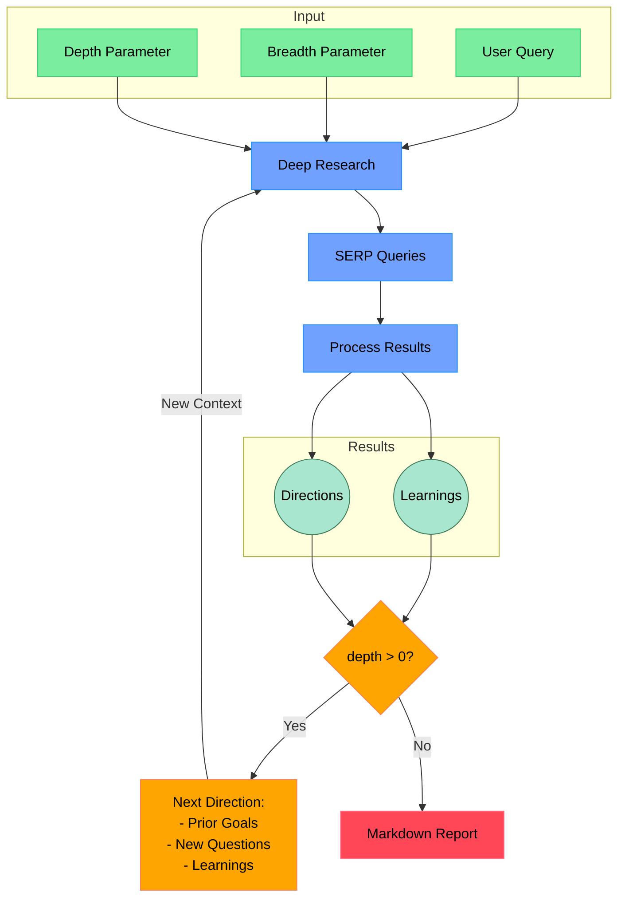

# Open Deep Research

An AI-powered research assistant that performs iterative, deep research on any topic by combining search engines, web scraping, and large language models.

The goal of this repo is to provide the simplest implementation of a deep research agent - e.g. an agent that can refine its research direction over time and deep dive into a topic. Goal is to keep the repo size at <500 LoC so it is easy to understand and build on top of.

If you like this project, please consider starring it and giving me a follow on [X/Twitter](https://x.com/dzhng). This project is sponsored by [Aomni](https://aomni.com).

## How It Works



## Features

- **Iterative Research**: Performs deep research by iteratively generating search queries, processing results, and diving deeper based on findings
- **Intelligent Query Generation**: Uses LLMs to generate targeted search queries based on research goals and previous findings
- **Depth & Breadth Control**: Configurable parameters to control how wide (breadth) and deep (depth) the research goes
- **Smart Follow-up**: Generates follow-up questions to better understand research needs
- **Comprehensive Reports**: Produces detailed markdown reports with findings and sources
- **Concurrent Processing**: Handles multiple searches and result processing in parallel for efficiency

## Requirements

- Node.js environment
- API keys for:
  - Firecrawl API (if `SEARCH_PROVIDER=firecrawl`)
  - Tavily API (if `SEARCH_PROVIDER=tavily` or `tavily+exa-mcp`)
  - Exa MCP runtime (if `SEARCH_PROVIDER=exa-mcp` or `tavily+exa-mcp`)
  - OpenAI API (for o3 mini model)

## Setup

### Node.js

1. Clone the repository
2. Install dependencies:

```bash
npm install
```

3. Set up environment variables in a `.env.local` file:

```bash
SEARCH_PROVIDER="tavily+exa-mcp" # default, firecrawl | tavily | exa-mcp | tavily+exa-mcp
# SEARCH_CONCURRENCY="2"
# SEARCH_RESULTS_LIMIT="5"
# SEARCH_TIMEOUT_MS="15000"
# SEARCH_SAME_URL_SIMILARITY_THRESHOLD="0.9"
# SEARCH_CROSS_URL_SIMILARITY_THRESHOLD="0.95"

FIRECRAWL_KEY="your_firecrawl_key"
# If you want to use your self-hosted Firecrawl, add the following below:
# FIRECRAWL_BASE_URL="http://localhost:3002"

# If you want to use Firecrawl instead, set:
# SEARCH_PROVIDER="firecrawl"
# FIRECRAWL_KEY="your_firecrawl_key"
#
# If you want to use Tavily, set:
# TAVILY_KEY="tvly-your_tavily_key"
# TAVILY_BASE_URL="https://api.tavily.com/search"
# TAVILY_SEARCH_DEPTH="advanced"
#
# If you want to use Exa MCP, set (defaults already match this):
# EXA_MCP_COMMAND="npx"
# EXA_MCP_ARGS="-y mcp-remote https://mcp.exa.ai/mcp"
# EXA_MCP_TIMEOUT_MS="25000"
# EXA_CONTEXT_MAX_CHARACTERS="12000"

OPENAI_KEY="your_openai_key"
```

To use local LLM, comment out `OPENAI_KEY` and instead uncomment `OPENAI_ENDPOINT` and `CUSTOM_MODEL`:

- Set `OPENAI_ENDPOINT` to the address of your local server (eg."http://localhost:1234/v1")
- Set `CUSTOM_MODEL` to the name of the model loaded in your local server.

### Docker

1. Clone the repository
2. Rename `.env.example` to `.env.local` and set your API keys

3. Run `docker build -f Dockerfile`

4. Run the Docker image:

```bash
docker compose up -d
```

5. Execute `npm run docker` in the docker service:

```bash
docker exec -it deep-research npm run docker
```

## Usage

Run the research assistant:

```bash
npm start
```

You'll be prompted to:

1. Enter your research query
2. Specify research breadth (recommended: 3-10, default: 4)
3. Specify research depth (recommended: 1-5, default: 2)
4. Answer follow-up questions to refine the research direction

The system will then:

1. Generate and execute search queries
2. Process and analyze search results
3. Recursively explore deeper based on findings
4. Generate a comprehensive markdown report

When using `tavily+exa-mcp`, the system runs both providers for the same query and merges results with two-level deduplication:

- URL-level dedupe (same URL)
- Content-similarity dedupe (different URLs but nearly identical content)
- Same URL with significantly different content is preserved as separate entries

The final output is saved with a topic-based, non-overwriting file name in your working directory, for example:

- `ai-chip-trends-report-2026-03-08T16-20-00Z.md`
- `ai-chip-trends-answer-2026-03-08T16-20-00Z.md`

### Concurrency

You can increase concurrency by setting `SEARCH_CONCURRENCY` (or the legacy `FIRECRAWL_CONCURRENCY`) when your search provider quota allows it.

If you use a free-tier provider, you may hit rate limits; set concurrency to `1` to reduce failures (slower but more stable).

### DeepSeek R1

Deep research performs great on R1! We use [Fireworks](http://fireworks.ai) as the main provider for the R1 model. To use R1, simply set a Fireworks API key:

```bash
FIREWORKS_KEY="api_key"
```

The system will automatically switch over to use R1 instead of `o3-mini` when the key is detected.

### Custom endpoints and models

There are 2 other optional env vars that lets you tweak the endpoint (for other OpenAI compatible APIs like OpenRouter or Gemini) as well as the model string.

```bash
OPENAI_ENDPOINT="custom_endpoint"
CUSTOM_MODEL="custom_model"
```

## How It Works

1. **Initial Setup**

   - Takes user query and research parameters (breadth & depth)
   - Generates follow-up questions to understand research needs better

2. **Deep Research Process**

   - Generates multiple SERP queries based on research goals
   - Processes search results to extract key learnings
   - Generates follow-up research directions

3. **Recursive Exploration**

   - If depth > 0, takes new research directions and continues exploration
   - Each iteration builds on previous learnings
   - Maintains context of research goals and findings

4. **Report Generation**
   - Compiles all findings into a comprehensive markdown report
   - Includes all sources and references
   - Organizes information in a clear, readable format

## Community implementations

**Python**: https://github.com/Finance-LLMs/deep-research-python

## License

MIT License - feel free to use and modify as needed.
